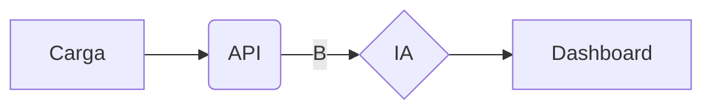

# ListBanks

## Descripción del proyecto
Muestreo de una lista de bancos con persistencia de datos , implementación especifica de ciertos parmetros de desarrollo como el Redux.Cypress , etc..

## Getting Started

Primero para instalar dependencias:

```bash

yarn install

```

Correr el sevidor:

```bash

yarn run dev

```

# Tecnologias

- NextJS -> "14"
- Tailwind -> "3.3.3"
- Formik -> "^2.2.9"
- React-Redux -> "^8.0.5"
- Reduxjs/toolkit -> "^1.9.4"
- Cypress -> "^12.17.1"

_Nota: Si se esta instalando dependecias importantes anotarlas aqui ._

## Arquitectura

Arquitectura de Renderizado en el Lado del Servidor (SSR): Esta arquitectura se centra en la entrega rápida de contenido dinámico y personalizado en el servidor. En una arquitectura SSR, el contenido se genera en el servidor y se envía al cliente en lugar de generar todo el contenido en el navegador. Esto reduce el tiempo de carga y mejora la experiencia del usuario.

También entra por default el uso de arquitectura modular y basada en componentes

## Semantica y nomeclatura de los archivos

Se seguiran los lineamientos estandar del uso de carpetas que se proporciona en NextJS (checar documentación del propio framerwork)

_Componentes_

El manejo de los componentes y el tipo de extensión se realizarían utilizando JSX, siguiendo las mismas reglas que React.

ComponentName.jsx

_Pages_

NextJS ya gestiona su propio enrutamiento y la gestión de archivos simplemente sigue sus pautas tal como se describe en su documentación oficial.

## Exportaciones

Se tiene una importación con una configuracion en el archivo jsconfig.json , esto es para tener más limpio las importaciones.

## Diagramas

El diagrama cambiará conforme este la comunicación del backend para el desarrollo



## Learn More

Para el ambiente de pruebas es necesario tener los pasos anteriores leidos y comprendidos

Primero 

Correr el sevidor:

```bash

yarn run dev

```

Teniendo una venta nueva de tu shell , terminal etc 


```bash

yarn cypress open

```
Se desplegara un menu donde podrá hacer las pruebas interpuestas en el archivos de test


## Learn More

To learn more about Next.js, take a look at the following resources:

- [Next.js Documentation](https://nextjs.org/docs) - learn about Next.js features and API.
- [Learn Next.js](https://nextjs.org/learn) - an interactive Next.js tutorial.

You can check out [the Next.js GitHub repository](https://github.com/vercel/next.js/) - your feedback and contributions are welcome!

## Version

Se manejara la nomenclatura estandar de desarrollo.

1.0.0-beta

Major
Minor
Patch
Opcional pre-release


## Deploy on Vercel

The easiest way to deploy your Next.js app is to use the [Vercel Platform](https://vercel.com/new?utm_medium=default-template&filter=next.js&utm_source=create-next-app&utm_campaign=create-next-app-readme) from the creators of Next.js.

Check out our [Next.js deployment documentation](https://nextjs.org/docs/deployment) for more details.
